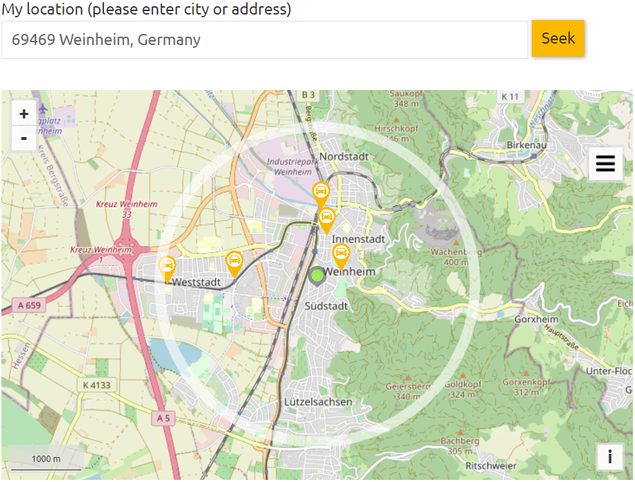
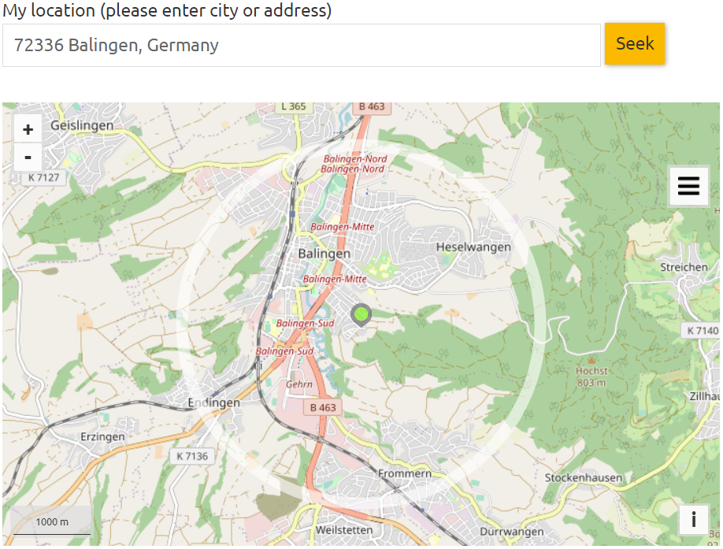

```{r xaringan-themer, include=FALSE, warning=FALSE}
library(xaringanthemer)
style_mono_light(
  #link_color = "red",
  #title_slide_background_color = "red",
  base_color = "#1c5253",
  header_font_google = google_font("Josefin Sans", "200"),
  text_font_google   = google_font("Montserrat", "200", "200i"),
  code_font_google   = google_font("Fira Mono"),
  extra_css = list(
    ".title-slide h3" = list("font-size" = "medium")
  )
)
```


```{css, echo=FALSE}
# CSS for including pauses in printed PDF output (see bottom of lecture)
@media print {
  .has-continuation {
    display: block !important;
  }
}
```

```{r setup, include=FALSE}
# xaringanExtra::use_scribble() ## Draw on slides. Requires dev version of xaringanExtra.

options(htmltools.dir.version = FALSE)
library(knitr)
opts_chunk$set(
  fig.align="center",  
  fig.height=4, #fig.width=6,
  # out.width="748px", #out.length="520.75px",
  dpi=300, #fig.path='Figs/',
  cache=T#, echo=F, warning=F, message=F
  )
library(tidyverse)
library(hrbrthemes)
library(fontawesome)
library(readxl)
library(janitor)
```


## Research idea

#### Problem

- Transportation major contributor to greenhouse emissions
- Technological advances (e.g. electrification) promise decarbonization in transportation ...
- ... but besides technology which potential bear "Mobility as a Service" concepts?

--

#### Motivation

- Personally started to use cars haring offerings extensively this year
- Observe car sharing providers extending their fleets

--


--

#### Research question

> *"Do regional 'Mobility as a Service' offerings substitute individual transport?"*

--

---

## Data (1)

Number of newly registered cars by [Federal Motor Transport Authority](https://www.kba.de/DE/Statistik/Fahrzeuge/Neuzulassungen/neuzulassungen_inhalt.html?nn=2601598)

--

```{r kba, warning=FALSE, message=FALSE}
# Read newly registered cars for year 2020. Data available from 2006 on -> Panel!
new_cars <- readxl::read_excel("01_Data\\02_Bestand\\fz3_2021.xlsx", sheet = "FZ 3.1", skip = 8, na = c('.')) %>% 
  clean_names() %>% 
  select(plz_gemeinde, insgesamt_5, darunter_gewerbliche_halter) %>% 
  filter(str_detect(plz_gemeinde, pattern = "\\d{5}")) %>% 
  mutate(plz_gemeinde = str_remove(plz_gemeinde, pattern = "\\,.*")) %>% 
  rename(c("region" = "plz_gemeinde", "number_cars" = "insgesamt_5", "number_cars_commercial" = "darunter_gewerbliche_halter")) 
new_cars %>% 
  print(n=5)
```

---

## Data (2)

Location of car sharing vehicles by [Industry Association of German car sharing organisations](https://carsharing.de/cs-standorte)

 

<div class="column">
  
  
</div>


---

## Scraper


```{r bcs, warning=FALSE, message=FALSE}
# introduce scraper here
```


